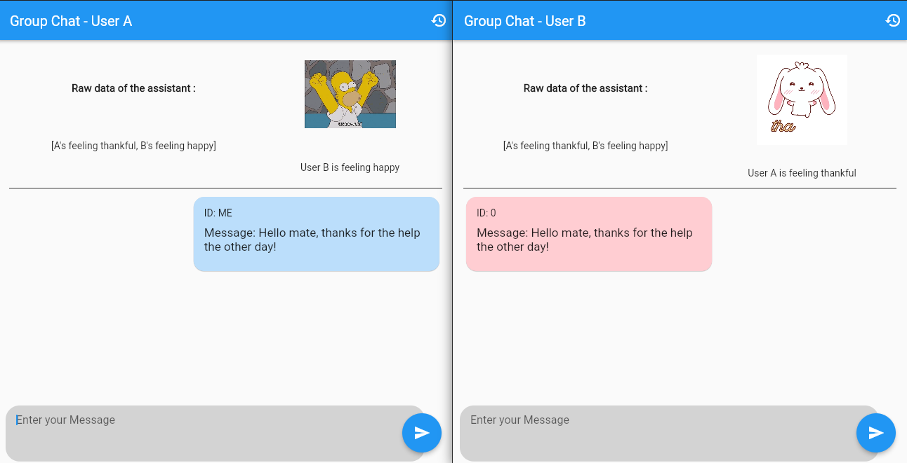
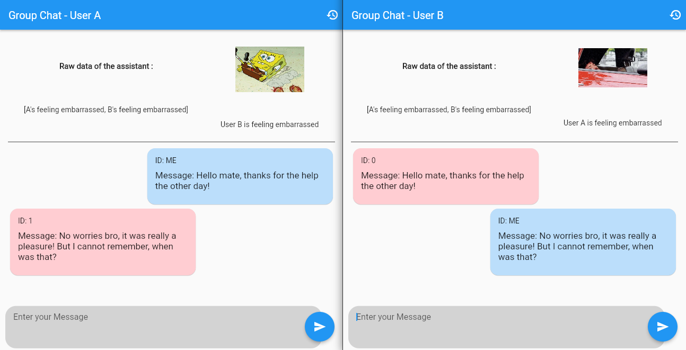
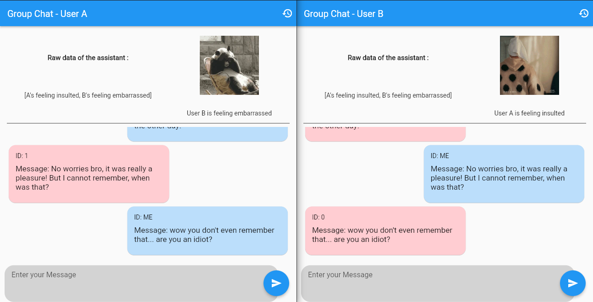
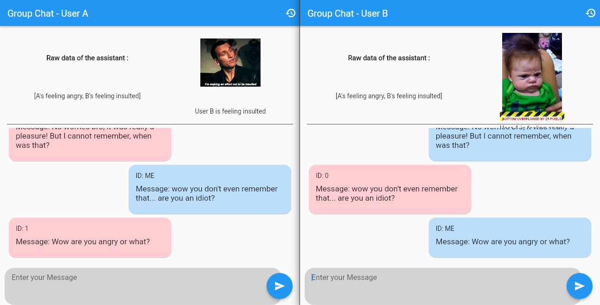
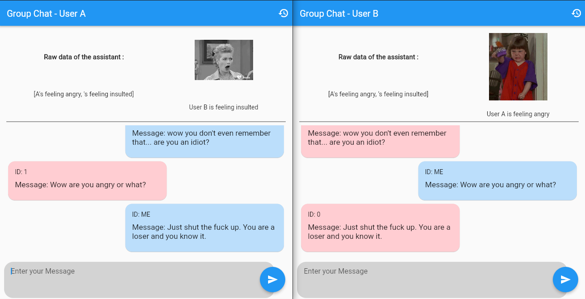

# CHATMO - STARTHACK 2022

### Introduction
This project was developped during [StartHack](https://www.starthack.eu/program). 

## SUPERCELL CASE

Bringing non verbal communication to the virtual world

### Problematic
**Empathy** is missing in the virtual world
- Nowaday people are strongly connected but emotionally distant
- We looked at a more specific case of chat room

## Our Solution : CHATMO

### What is Chatmo ?
The assistant that processes anonymously each message, inferring what the users are feeling in real-time at a remarkable emotional depth. 

### Qualities
- Very portable and **reusable** piece of software, which can be virtually integrated everywhere.
- ChatMo is **privacy preserving**, contrary to other invasive techniques like facial recognition.

## Usage

##### You will need to create an API key for openAI to run our backend. [More infos here.](https://beta.openai.com/overview)
- In backend directory, create a file `config.py` and add a variable `openAI_API_key = "YOUR OPENAI API KEY"`

#### Local

##### Frontend
- From frontend directory, launch flutter with `flutter run -d chrome`
- It opens only 1 chrome window representing your first user. Do `Alt + D` and `Alt + Enter` to have your seconde user

##### Backend
- From backend directory, launch server with `python3 app.py`

## Example

Message 1             |  Message 2
:-------------------------:|:-------------------------:
 |  

Message 3            |  Message 4
:-------------------------:|:-------------------------:
 | 

Message 5 |
:-------------------------:|

## Improvements

- We used GIFs to represent user's emotion as they are more expressive than smileys. The main drawback is that GIF are always a bit funny and it is not necessarly what you want to express feelings such as sadness, anger, ... Our aim was to use Telegram's animated smileys.
- User's feeling that are shown on the conversation are fully decided by the IA. Users have no control over it. What we wanted to do is ask the user if the feeling decided by the IA represents well how he feels. 
- We could use user feedback to personalize our model and make it more accurate user-wise.
- If user A try to send profanitiesto user B, we could show a pop-up saying "Are you sure you want to send this message to B ?" .
- Extend the tool so it can be used in a group chat, not just a 1-to-1 conversation.
- In a group chat, if a user is beeing bullied, we could ask the bullied if he wants help and notify other participants to help him. 
